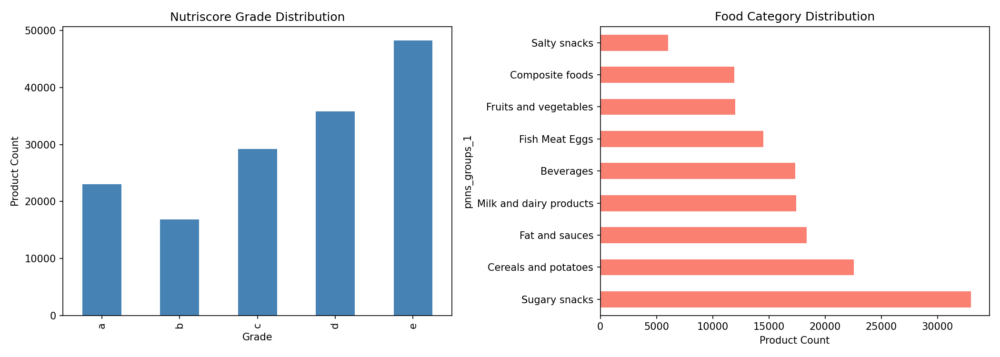
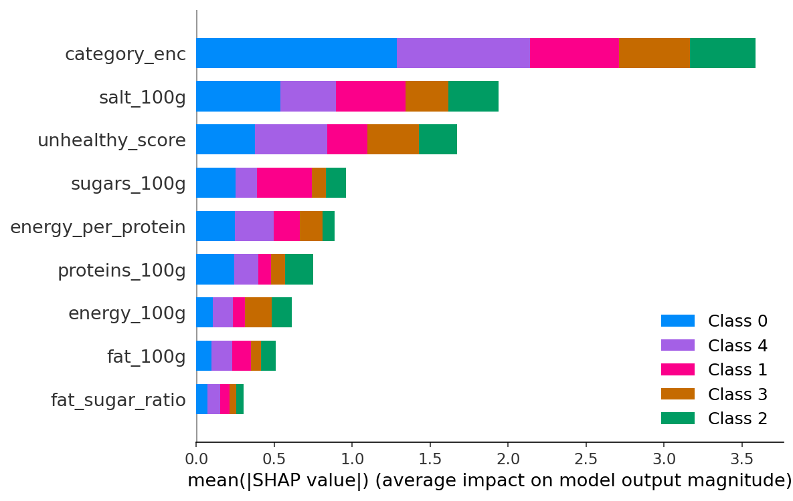
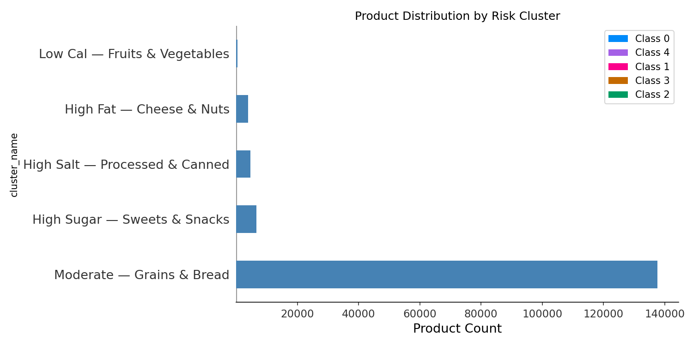

# 🛒 FreshGuard — Food Waste & Spoilage Prediction

## Overview
FreshGuard predicts food spoilage risk using nutritional data from Open Food Facts.
The goal is to help retailers like Rewe and Lidl reduce food waste by identifying high-risk products before they expire.

## Dataset
- Source: [Open Food Facts](https://world.openfoodfacts.org/)
- Size: 500,000+ products
- Features: nutritional values (energy, fat, sugar, protein, salt), food category, Nutriscore grade

## Results

### Nutriscore & Category Distribution


### Most Important Features (SHAP)


### Product Risk Clusters


## Machine Learning Pipeline
| Step | Method |
|---|---|
| Classification | XGBoost, LightGBM, Logistic Regression |
| Clustering | KMeans |
| Anomaly Detection | Isolation Forest |
| Explainability | SHAP |

## Model Results
- Best model accuracy: 0.55 (XGBoost & LightGBM)
- Most important feature: Food category, followed by salt content
- High risk groups: Sugary Snacks, High Salt processed foods

## How to Run
```bash
pip install -r requirements.txt
streamlit run app.py
```
## How this project was built
- Data analysis and ML modeling: Google Colab (`fresh_guard.ipynb`)
- Web application: Streamlit (`app.py`)
- Models saved as pickle files and loaded in the app

## Tools
Python, Pandas, Scikit-learn, XGBoost, LightGBM, SHAP, Streamlit


👤 Developer
GitHub: @sel-DS
